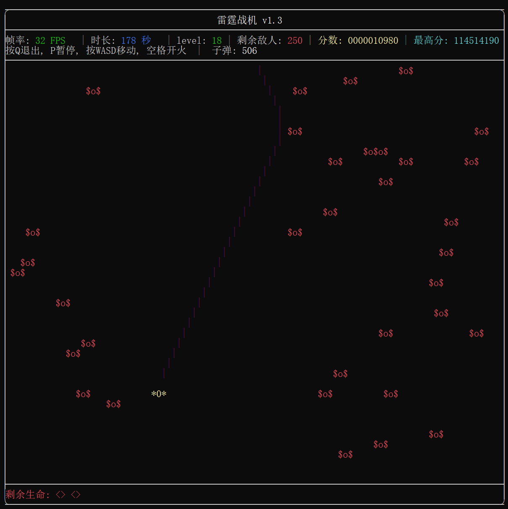

# 雷霆战机 v1.3

一个基于 **C++17** 与 **FTXUI** 的终端射击小游戏，运行于 **Windows 控制台** 环境。  
项目完整实现了游戏主循环、结算界面与 **历史最高分 TOP 5 排行榜**，支持多局连续游玩与数据持久化。

---

## 项目简介

**雷霆战机（Thunder Fighter）** 是一款终端纵向射击游戏。  
玩家操控飞机在有限生命与弹药条件下躲避敌人、发射子弹击败敌机，尽可能获得更高分数。

本项目注重 **游戏循环结构、状态管理与终端 UI 渲染**，适合作为：

- 小型练习项目  
- 终端 UI（FTXUI）实践示例  
- 小型游戏架构入门案例  

---

<p align="center">
  
</p>

---

## 游戏操作

| 按键 | 功能 |
|-----|----|
| `W` | 向上移动 |
| `A` | 向左移动 |
| `S` | 向下移动 |
| `D` | 向右移动 |
| `Space` | 发射子弹 |
| `R` | 结算界面重新开始 |
| `Q / ESC` | 退出游戏 |
| `P` | 暂停游戏 |

---

## 已实现功能

### 核心玩法
- 玩家飞机移动（WASD）
- 敌人随机生成与下落
- 子弹系统（多发子弹 + 有限弹药）
- 子弹命中敌人并消灭
- 击败敌人加分
- 剩余弹药结算加分

### 游戏系统
- 生命值系统（扣血 + 无敌时间）
- FPS 实时显示
- 游戏运行时间统计
- 等级系统（随时间提升难度）
- 游戏结束结算界面
- 结算界面不退出程序，可重复游玩

### 排行榜系统
- 本地保存 **历史最高分 TOP 5**
- 自动排序并持久化到文件
- 显示本局得分在排行榜中的排名
- 明确提示：
  - 是否创造历史最高分
  - 是否进入历史前五
  - 未进入前五的提示

---

## 程序结构概览

```text
Thunder_fighter_jet/
├── src/
│   ├── main.cpp              # 程序入口
│   ├── def.h / def.cpp       # 核心游戏逻辑（主循环 / 渲染 / 子弹 / 排行榜）
│   ├── enemy.h / enemy.cpp   # 敌人结构与行为
│   ├── cheats.cpp            # 调试 / 作弊功能
├── build/                    # CMake 构建目录
├── highscore.txt             # 本地历史最高分数据
└── README.md
```
---
```
程序启动
   ↓
游戏主循环（Run）
   ↓
玩家操作 / 敌人刷新 / 子弹碰撞
   ↓
生命耗尽 或 主动退出
   ↓
结算界面（显示分数 & 排名）
   ↓
R → 重置游戏并重新开始
Q → 退出程序
```

### 调试/作弊指令 (Cheats)
*   `4`: 加分 (+1000)
*   `5`: 无敌模式开关
*   `6`: 增加生命
*   `7`: 秒杀全屏敌人
*   `8`: 清空当前敌人
*   `9`: 强制升级关卡

## 编译与运行

### 编译环境
- C++17
- Windows
- MinGW / MSVC
- CMake
- vcpkg
- FTXUI

### 构建示例 (MinGW + vcpkg)

确保你已经安装了 vcpkg 并下载了 ftxui 库 (`vcpkg install ftxui:x64-mingw-static`)。

```
mkdir build
cd build
# 请将下面路径中的 [path/to/vcpkg] 替换为你的实际 vcpkg 安装路径
cmake .. -G "MinGW Makefiles" -DCMAKE_TOOLCHAIN_FILE=[path/to/vcpkg]/scripts/buildsystems/vcpkg.cmake
cmake --build .
```

运行生成的可执行文件即可开始游戏。(应该吧)
```
./Thunder_fighter_jet.exe
```

### 版本更新记录
- v1.3
   - 主要完成了游戏结束时的重启
   - 完成了几个函数的重构

## License

This project is licensed under the MIT License.